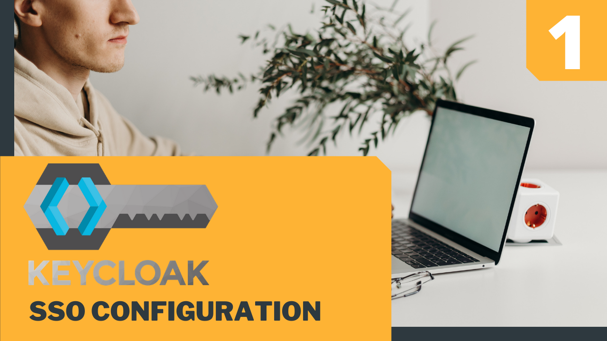
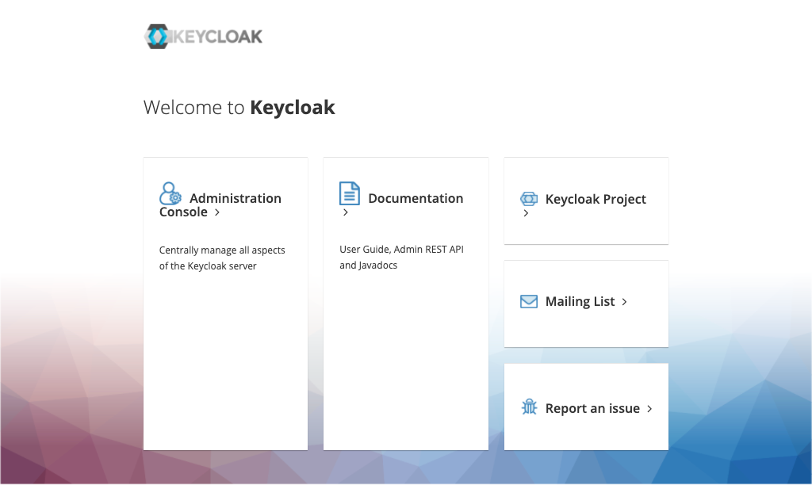
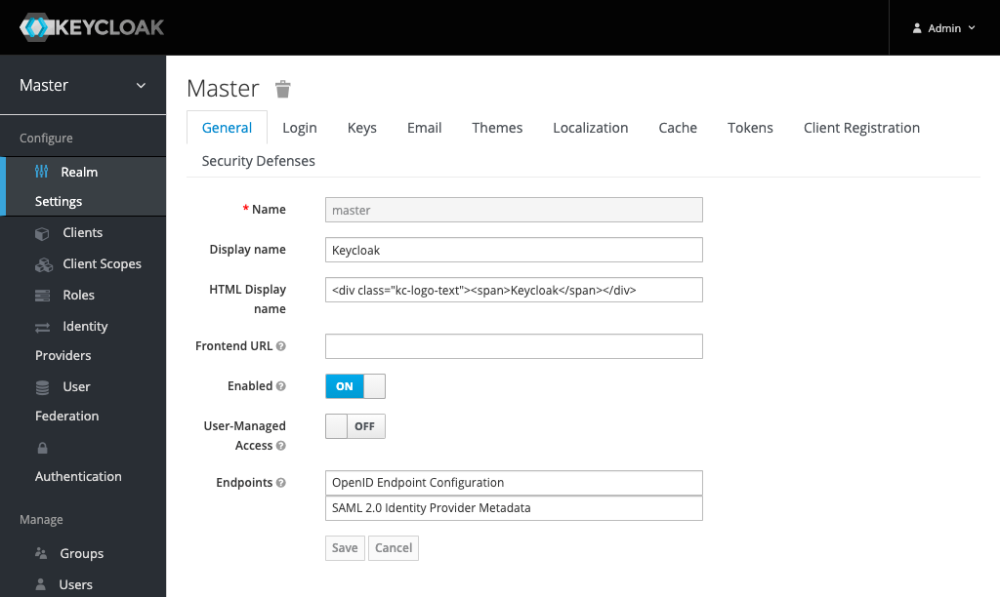

SSO Keycloak POC
=====================

This `SSO Demo` uses four container instances:
- keycloak: the OAuth2(OpenID connection) server instance
- db: the mysql server instance for keycloak backend
- app1: simple php web app
- app2: simple php web app


## Pre Install
Be sure that the `docker engine` & `docker-compose` are installed.

- Install docker engine: https://docs.docker.com/engine/installation/
- Install docker-compose: https://docs.docker.com/compose/install/

---

## Config the `keycloak` server
- import the project config
- add the test user for SSO
- add the password to the test user

Tutorial on youtube: <https://youtu.be/G4IQlV65Sl0>

<a href="https://youtu.be/G4IQlV65Sl0">
  
</a>

## Demostrate the web apps with `sso`

Tutorial on youtube : <https://youtu.be/M2pz9RoE9zA>

<a href="https://youtu.be/M2pz9RoE9zA">
  
</a>


## Start and clean up
start the container instanc
```bash
# start the containers
bash run.sh start 

# stop the containers
bash run.sh stop

# clean up the containers
bash run.sh clean
```

### Urls
Open the admin console and the apps on the following URLs
```bash
# Keycloak admin console
http://localhost:8080/auth

# Web-app-1
http://localhost:8091/

# Web-app-2
http://localhost:8092/
```

### Keycloak Admin Login
```bash
user: admin
password: admin
```

### Screenshots





