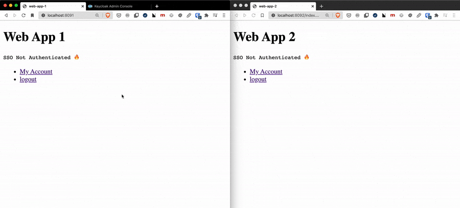
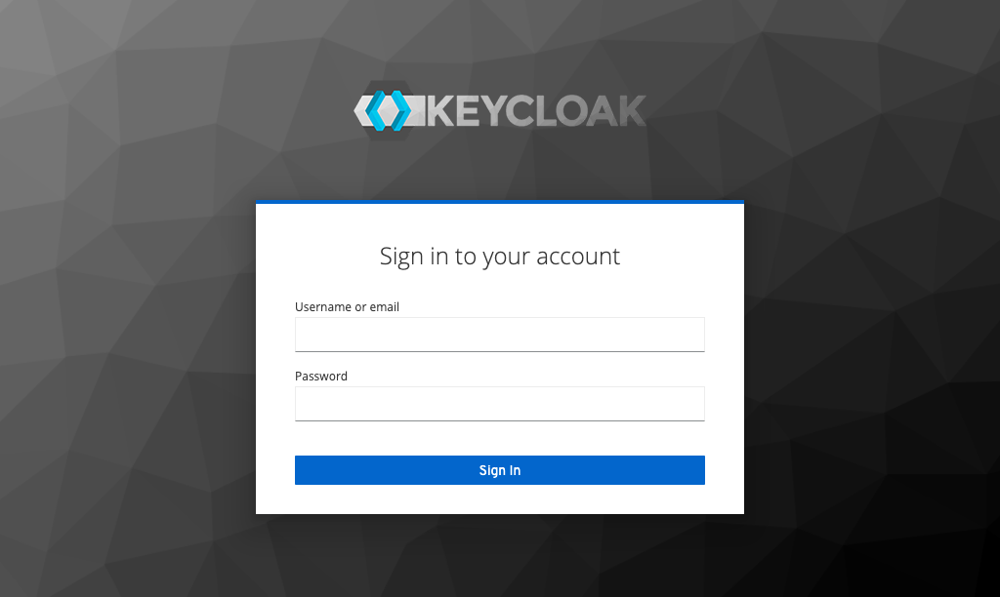
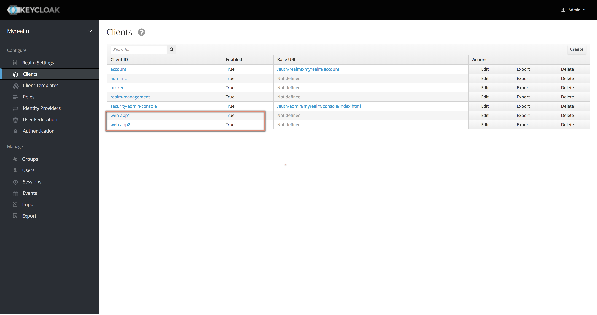
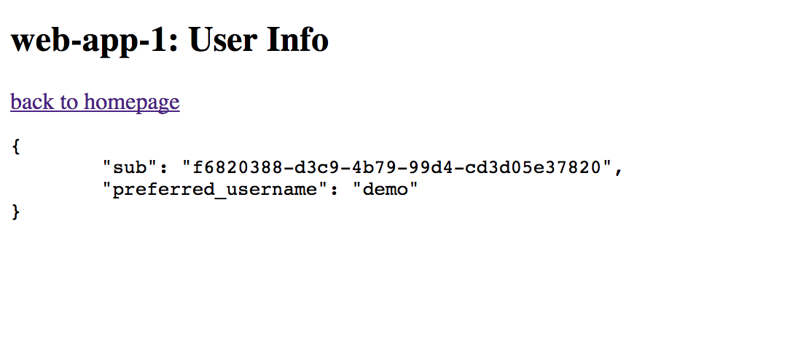

SSO Keycloak POC
=====================
This `SSO Demo` uses four container instances:
- keycloak: the OAuth2(OpenID connection) server instance
- db: the mysql server instance for keycloak backend
- app1: simple web app
- app2: simple web app


## Test case:
The user tries to access the user profile page on one of the web app,
and is redirected to login page on `keycloak` server at first.

If user is logged in, the further `authentication` on the other web apps will
not be required.


# Pre Install
Be sure that the `docker engine` & `docker-compose` are installed.

- Install docker engine: https://docs.docker.com/engine/installation/
- Install docker-compose: https://docs.docker.com/compose/install/



# step 1: 
start the container instanc
`bash doority.sh start`


# step 2: 
Login on `keycloak` on `[localhost:8080](http://localhost:8080/auth/)`




```angular2html
user: admin
password: admin
```


# step 3: 
create new `realm` named `myrealm`


# step 4: 
create new clients named with `web-app1` and `web-app2`


> repeat the operation to create another client named `web-app2`



# step 5:
create new user named `demo`

```angular2html
user: demo
password: demo
```


# step 6:
update the client credentials in `app1/app.js` with the created client credentials:

```javascript
//app1/app.js
let keycloakConfig = {
    "realm": "myrealm",
    "auth-server-url": "http://127.0.0.1:8080/auth",
    "ssl-required": "external",
    "resource": "web-app1",
    "credentials": {
        "secret": "90d014fa-89bf-45b5-ab87-bcd8a9028c7f"
    },
    "confidential-port": 0,
    "clientId": "web-app1"
};
```

> repeat the operation to update the credentials in `app2`

# step 7:
open the two web apps on
```javascript
http://localhost:8091/
http://localhost:8092/
```


# step 8:
click on the link named `my account` on `web-app1`, the user should be redirected
to login page on the keycloak server `http://localhost:8080/auth/realms/myrealm/protocol/openid-connect/auth?client_id=web-app1&redirect_uri=http%3A%2F%2Flocalhost%3A8091%2Fme.html&state=228f9b01-2b83-446e-89ce-aac4bfba845e&nonce=82123d67-d176-403b-92aa-2303617d5183&response_mode=fragment&response_type=id_token%20token&scope=openid`

Login with
```javascript
user: demo
passL demo
```
After login, the user profile page will be shown:



# step 9:
click on the link named `my account` on `web-app2`, the user will `NOT` be redirected 
to login page, because of login on the `web-app1` in the `step 8`.


> To clean up the test instances
```javascript
bash doority.sh clean
```
