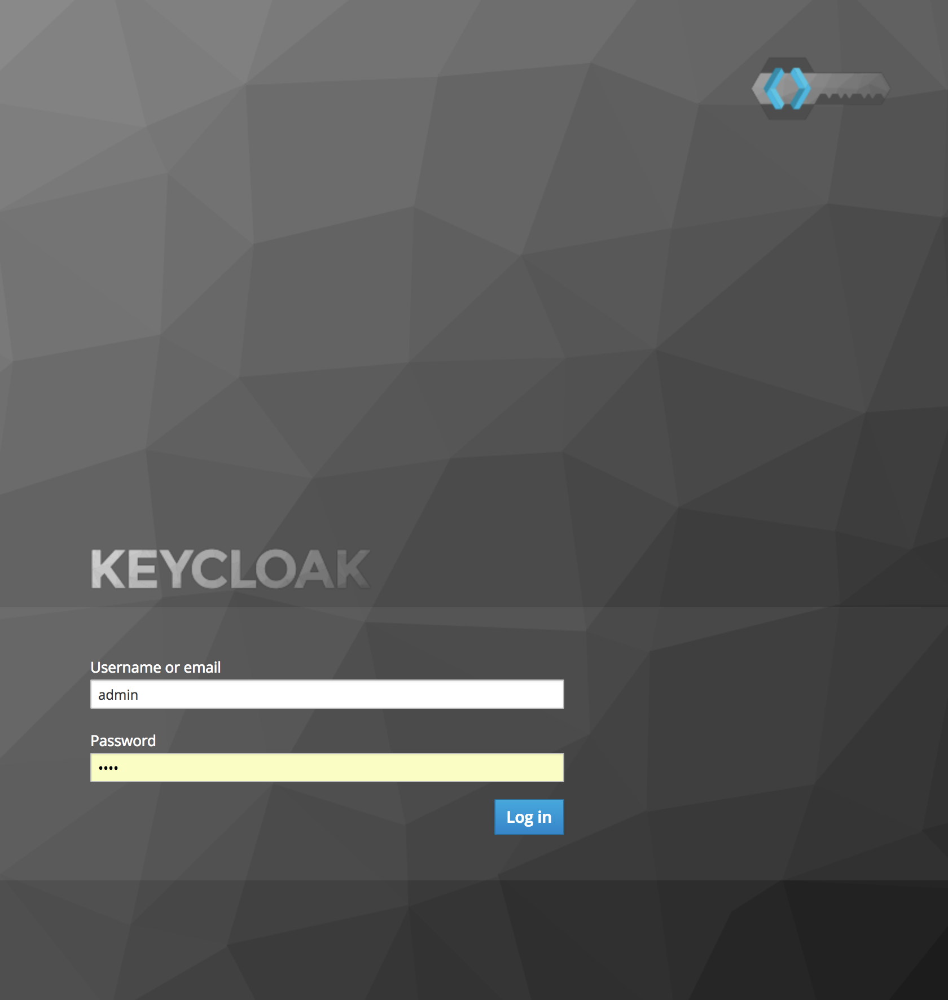
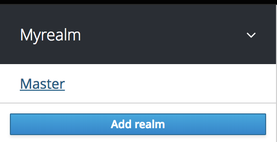
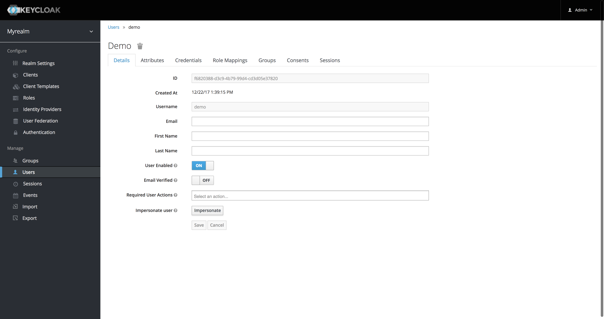
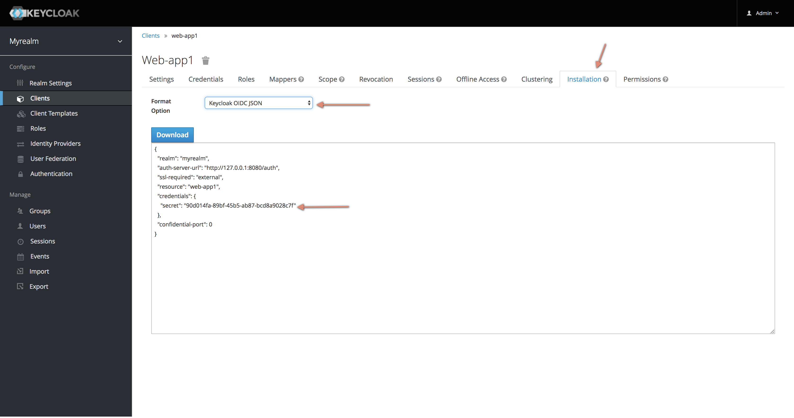
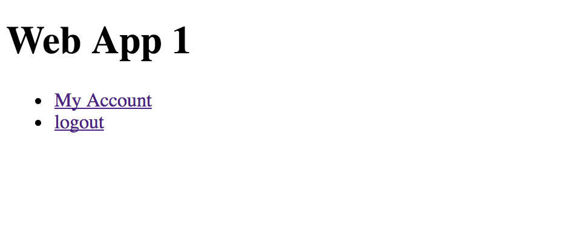
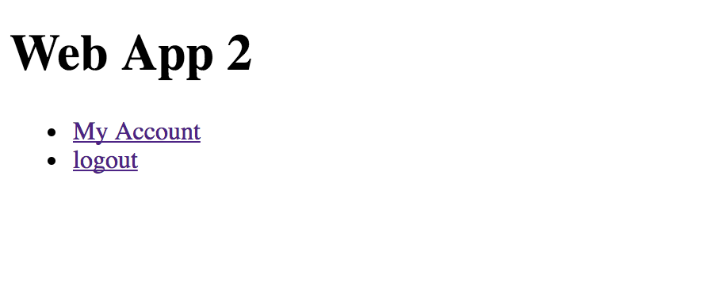

SSO Keycloak POC
=====================


# Pre Install
Be sure that the `docker engine` & `docker-compose` are installed.

- Install docker engine: https://docs.docker.com/engine/installation/
- Install docker-compose: https://docs.docker.com/compose/install/


# step 1: 
start the container instanc
`bash doority.sh start`


# step 2: 
Login on `keycloak` on `localhost:8080`


```angular2html
user: admin
password: admin
```


# step 3: 
create new `realm` named `myrealm`


# step 4: 
create new clients named with `web-app1` and `web-app2`


> repeat the operation to create another client named `web-app2`


# step 5:
create new user named `demo`

```angular2html
user: demo
password: demo
```


# step 6:
update the client credentials in `app1/app.js` with the created client credentials:

```javascript
//app1/app.js
let keycloakConfig = {
    "realm": "myrealm",
    "auth-server-url": "http://127.0.0.1:8080/auth",
    "ssl-required": "external",
    "resource": "web-app1",
    "credentials": {
        "secret": "90d014fa-89bf-45b5-ab87-bcd8a9028c7f"
    },
    "confidential-port": 0,
    "clientId": "web-app1"
};
```

> repeat the operation to update the credentials in `app2`

# step 7:
open the two web apps on
```javascript
http://localhost:8091/
http://localhost:8092/
```




